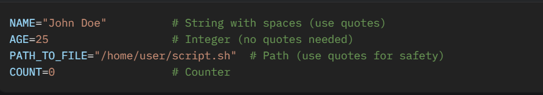

# What Are Variables in Shell Scripting and How to Write Them:
## What Are Variables in Shell Scripting?
## Definition: 
#### Variables are named storage locations in memory that hold data (e.g., strings, integers) during script execution. You assign a value to a variable, and later reference it by its name to retrieve or modify that value.
## Purpose: 
### They make scripts flexible and reusable by allowing you to:

##### >Store user inputs (e.g., a username from the command line).
##### >Hold intermediate results (e.g., a file path after creation).
##### >Avoid hardcoding values, making scripts adaptable to different environments.
## Types:
 >###### Bash variables are untyped—meaning they don’t have a fixed data type (e.g., string or integer). The same variable can hold a number (5) or a string (hello) depending on the context.
>###### Scope: Variables can be local (within a function or script) or exported as environment variables (available to subprocesses). By default, they are local unless explicitly exported with export.

## How to Write and Use Variables in Shell Scripting
###### In Bash, writing variables involves declaring them, assigning values, and referencing them with specific syntax. Here’s a detailed guide:
###### 1. Declaring and Assigning Variables

>Syntax: VARIABLE_NAME=value

>No spaces around the = (e.g., VARIABLE_NAME = value will cause an error).
Variable names are case-sensitive (e.g., USER and user are different).
Use uppercase (e.g., USERNAME) by convention for user-defined variables, though lowercase is fine.

